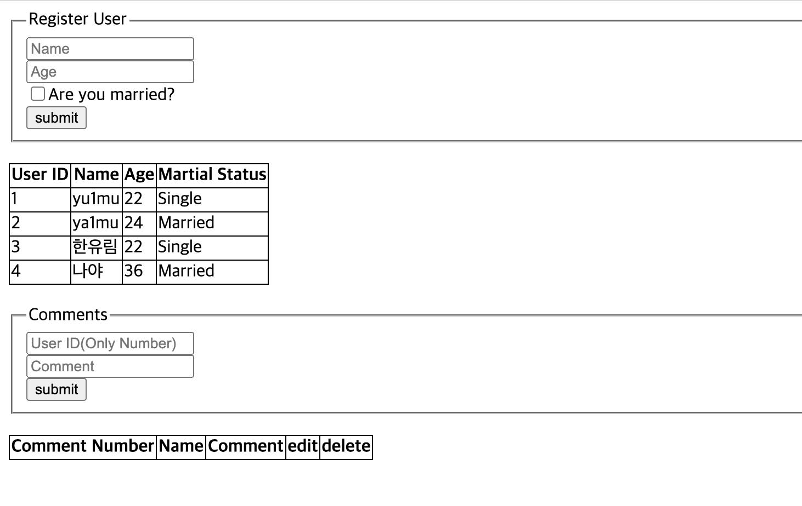
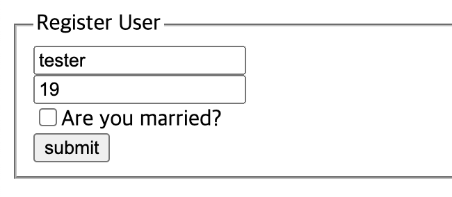
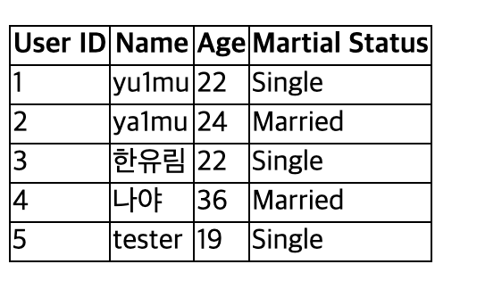
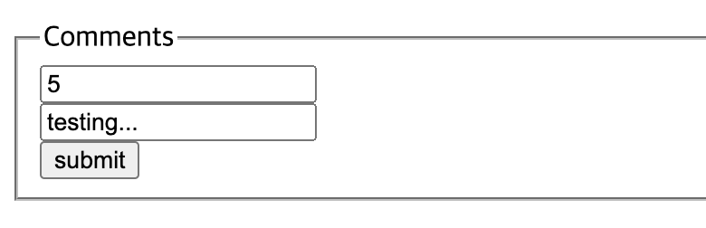
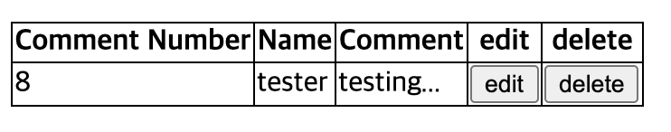

댓글 작성 서비스 (간이 블로그)
--
### 사용한 시스템
* Node.js, Express 기반
* RDBMS : MySQL
* 라이브러리 : Sequelize

### 사용 방법

```
> npm start
```
*  터미널에서 `learn-sequelize` 폴더에 들어가 위 명령어 입력 후  `http://localhost:3000`에 접속
 

### 사용 예시
> http://localhost:3000


다음과 같은 화면으로 구성하였음.  
사용자 등록 창에는 이름과 나이(한 단위 이동 UI 지원)를 입력할 수 있는 칸, 그리고 기혼 여부를 묻는 체크 박스가 있음.


    
이름과 나이, 기혼 여부를 입력하면 아래의 사용자 정보에 ID를 비롯한 정보를 기록한 표가 뜨게 됨.

  
댓글 입력 창에는 ID와 댓글 내용을 입력함.

  
사용자 등록 창에서 사용자 이름을 클릭하면 해당 사용자가 쓴 댓글들을 모두 볼 수 있음.
